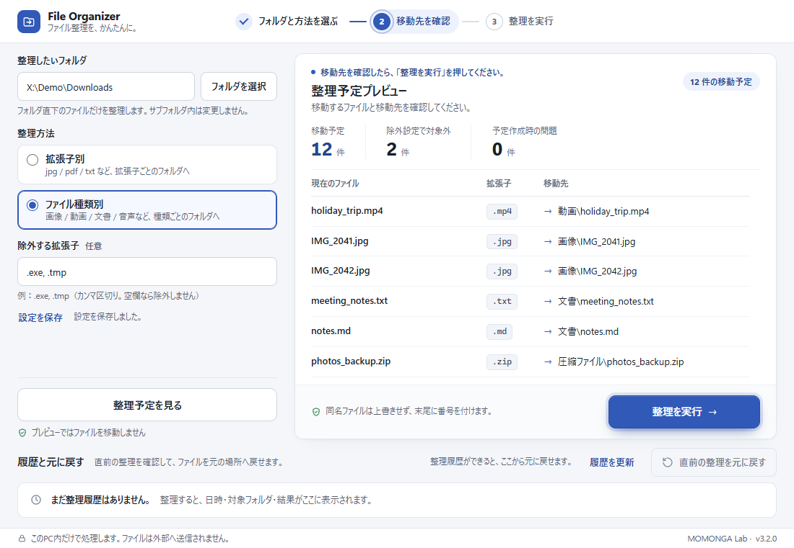
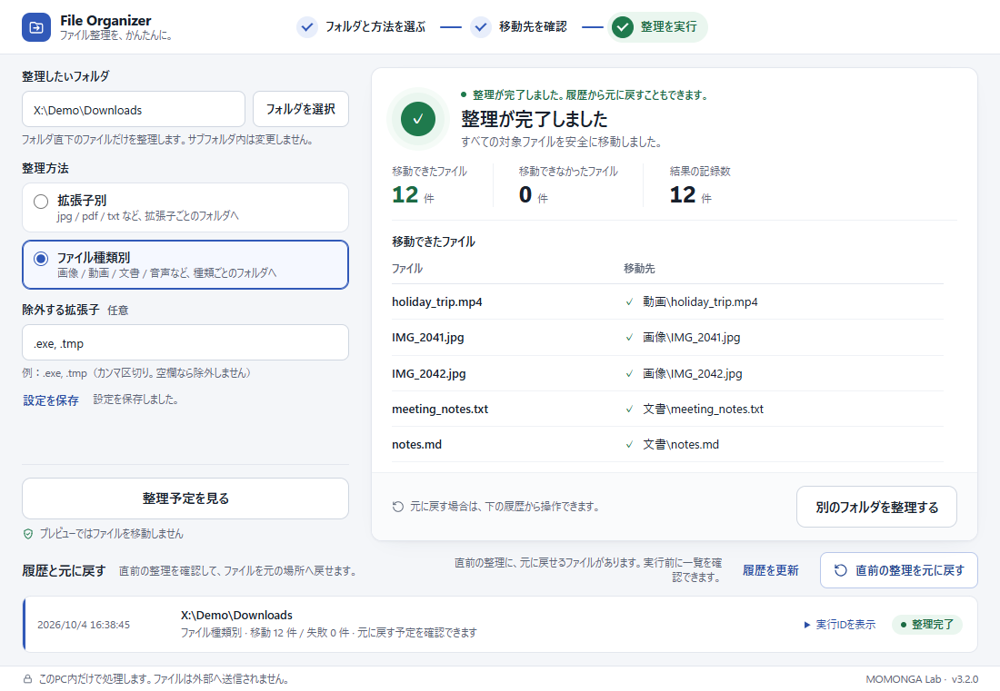

# File Organizer

**Windows 向けのファイル整理デスクトップアプリ** — MOMONGA Lab

フォルダ内のファイルを、拡張子別またはファイル種類別のフォルダへ整理します。
移動する前に必ず整理予定（プレビュー）を確認でき、同名ファイルを上書きせず、直前の整理は元に戻せます。
処理はすべてこの PC 内で完結し、ファイルやファイル名を外部へ送信しません。

*A safety-first Windows desktop app that organizes files by extension or file type, with a preview before every move, no overwrites, history and Undo.*



## 主な機能

- **フォルダ選択** — Windows のフォルダ選択ダイアログ、またはパスの直接入力
- **拡張子別整理** — `photo.JPG` → `jpg\photo.JPG` のように、拡張子ごとのフォルダへ
- **ファイル種類別整理** — 画像 / 動画 / 音声 / 文書 / 圧縮ファイル / その他 のフォルダへ
- **除外する拡張子** — `.exe, .tmp` のように指定した拡張子は移動しない
- **設定の保存** — 整理方法と除外設定を次回起動時に復元
- **整理前プレビュー** — 移動するファイル・移動先・件数を一覧で確認（プレビューではファイルを移動しません）
- **確認ダイアログ付きの整理実行** — バックグラウンド処理と進捗表示、成功・失敗の結果表示
- **同名ファイルの上書き防止** — 移動先に同名ファイルがあれば `_1`, `_2` … を付けて保存
- **実行履歴** — 最新 50 件の日時・対象フォルダ・整理方法・結果
- **Undo（元に戻す）** — 直前の整理を、復元予定の一覧を確認してから元の場所へ戻す
- **多重起動対策** — 2 つ目の起動を拒否
- **LOCALAPPDATA への状態保存** — 設定・履歴を `%LOCALAPPDATA%\MOMONGA_Lab\FileOrganizer\` に保存
- **Windows デスクトップアプリ** — 専用ウィンドウで動作。配布版は Python 不要
- **画面サイズ / DPI への自動対応** — 初期ウィンドウ（目標 1100×800）が画面の作業領域に収まるよう、表示倍率（125% / 150% など）を考慮して自動で縮小・中央表示

## Safety

このアプリはユーザーの実ファイルを移動するため、便利さより安全性を優先して設計しています。

- **実行前に必ずプレビュー** — 整理は「プレビュー → 確認ダイアログ → 実行」の順でしか行えません。実行されるのはサーバーが発行したプレビューの内容だけです。
- **上書きしない** — 移動先に同名ファイルがあれば別名にします。プレビュー後に同名ファイルが現れた場合は、上書きせずにそのファイルだけ失敗として報告します。
- **元に戻せる** — 移動前にジャーナル（移動記録）を保存し、直前の整理を Undo できます。元の場所にすでにファイルがある場合は上書きせず、戻せなかった理由を表示します。
- **ファイルを削除しない** — ファイルの削除を目的としたアプリではありません。整理・Undo のどちらでも、ユーザーのファイルを削除・上書きしません。
- **対象を限定** — 選んだフォルダ直下の、拡張子のあるファイルだけが対象です。サブフォルダ内・拡張子のないファイル・シンボリックリンクは変更しません。
- **ローカル限定** — 内部サーバーは `127.0.0.1`（この PC 内）だけで待ち受けます。アカウント、外部 API、外部 CDN、Web フォントは使いません。
- **処理中の安全な終了** — 整理中・Undo 中にウィンドウを閉じても、処理の完了と履歴の保存を待ってから終了します。
- **重複操作の防止** — 処理中は設定変更・再実行・Undo を無効化し、サーバー側でも重複実行を拒否します。

> 最初はコピーした一時フォルダで試すことをおすすめします。このアプリはバックアップの代わりにはなりません。

## Screenshots

| 起動直後 | 整理予定プレビュー | 整理完了 |
| --- | --- | --- |
|  |  |  |

画面は現在の実装（Simple Workspace v3.2.0）を 1100×800 ウィンドウ相当で撮影したものです。ファイル名・フォルダはすべてデモ用のテストデータです。

## 動作環境（配布版）

- Windows 10 / 11（x64）
- .NET Framework 4.8
- Microsoft Edge WebView2 Runtime（未導入の場合は Microsoft の公式 Runtime を導入してください）

配布版は `File Organizer` フォルダ全体（`File Organizer.exe` と `_internal`）を展開し、`File Organizer.exe` を起動します。exe だけを取り出さないでください。

## Tech Stack

- Python
- Flask（ローカル API・画面配信）
- HTML / CSS / Vanilla JavaScript
- SQLite（Python 標準ライブラリ。設定・履歴・ジャーナル）
- pywebview（EdgeChromium / WebView2 の専用ウィンドウ）
- PyInstaller（Windows 配布ビルド、onedir）
- pytest / Playwright（テスト。Playwright は既存の Microsoft Edge を使用する任意の UI テスト）

## Development / Build

開発には Python 3.10 以降が必要です（開発・動作確認は Python 3.14）。以下はリポジトリのルートで実行します。

```powershell
# 依存関係（Flask, pywebview, PyInstaller, pytest）
python -m pip install -r requirements-build.txt

# デスクトップアプリとして起動
python desktop_app.py

# テスト（UI テストも行う場合は requirements-ui-test.txt も導入）
python -m pip install -r requirements-ui-test.txt
python -m pytest tests -q -o pythonpath=.
node --check static/app.js

# Windows 配布ビルド（dist/File Organizer/ に出力）
python -m PyInstaller --noconfirm --clean FileOrganizer.spec

# 配布用 ZIP と SHA256（利用条件・第三者ライセンスを同梱し dist/release-<版>/ に出力）
python tools/make_release_zip.py
```

`build_windows.bat` を使うと、専用の仮想環境の作成・依存のインストール・全テスト・ビルドを順に実行します。
生成した exe の実機確認は `tests/test_desktop_exe.ps1` で行えます（一時的な保存先を使用）。

## Project Structure

| パス | 内容 |
| --- | --- |
| `desktop_app.py` | 専用ウィンドウ、多重起動ロック、ローカルサーバー、正常終了、ウィンドウサイズ調整 |
| `web_app.py` | Flask アプリとローカル API |
| `organizer.py` / `organizer_service.py` | 整理ロジック、ジョブ、プレビュー、履歴、Undo、ジャーナル |
| `organization_rules.py` | 拡張子別 / ファイル種類別のルールと除外拡張子 |
| `local_state.py` | SQLite による設定・履歴の保存 |
| `app_config.py` | アプリ名・ブランド・バージョン・保存先 |
| `templates/` / `static/` | 画面（HTML / CSS / JavaScript） |
| `tests/` | pytest・UI テスト・Windows 実機確認スクリプト |
| `FileOrganizer.spec` / `build_windows.bat` | PyInstaller ビルド設定 |

## Documents

- [docs/TECHNICAL_NOTES.md](docs/TECHNICAL_NOTES.md) — 内部動作、ローカル API、Undo の詳細、ユーザーデータ、旧 Web / CLI 起動
- [UI_DESIGN_HANDOFF.md](UI_DESIGN_HANDOFF.md) — UI を変更する際に守る ID・API 契約
- [design_mockups/](design_mockups/) — 採用した Workspace デザインのモックと引き継ぎ資料
- [PHASE2_VERIFICATION.md](PHASE2_VERIFICATION.md) / [PHASE3A_VERIFICATION.md](PHASE3A_VERIFICATION.md) — 開発フェーズごとの検証記録

## 利用条件

- File Organizer は MOMONGA Lab のソフトウェアです。著作権は MOMONGA Lab に帰属します。
- 公式配布版（MOMONGA Lab が指定する販売ページ・配布ページから入手したもの）は、個人での利用と、企業・団体などの組織内での利用ができます。利用台数は購入時に示された条件に従い、特に示されていない場合は 1 台です。
- このリポジトリはソースコード閲覧用で、完成版の公式の配布場所ではありません。ソースコードは閲覧・学習や、自分だけが使う目的でのローカルビルドに利用できます。
- 無断での再配布・転売、ビルドしたものや改変版の配布・販売はできません。
- 詳しくは [TERMS_OF_USE.md](TERMS_OF_USE.md) をご確認ください。
- プライバシー: [PRIVACY.md](PRIVACY.md) ／ 第三者ソフトウェア: [THIRD_PARTY_NOTICES.md](THIRD_PARTY_NOTICES.md)

## Status

**Simple Workspace v3.2.0** — 現在の完成版です。

- Simple テーマ（Workspace 2 ペインレイアウト）を実装済み
- Windows デスクトップアプリとしての配布ビルドと実機確認済み
- 他のテーマ（カラーバリエーション等）は未実装です
